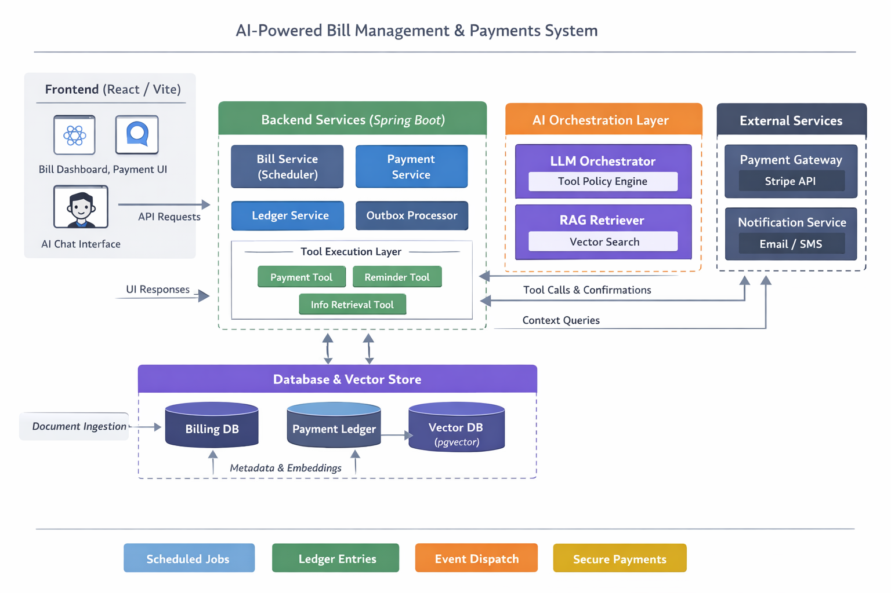
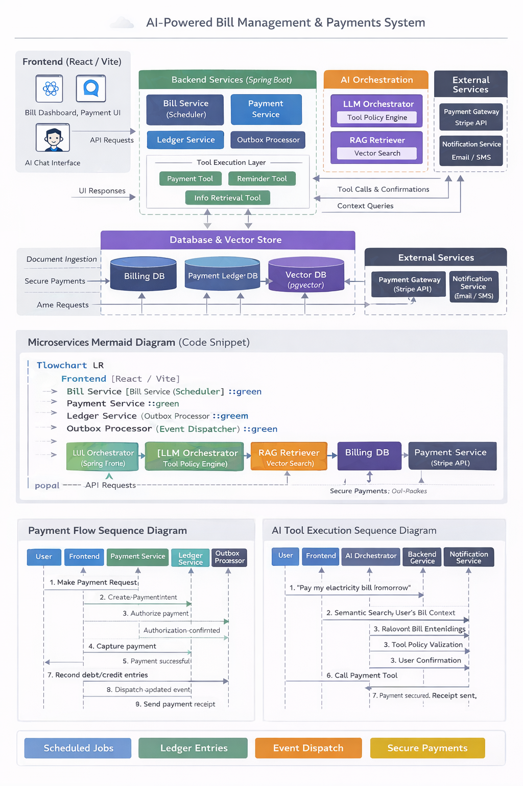

# 💡 AI-Powered Bill Management & Payments Platform (Spring AI + Fintech Architecture)

This project is a **fintech-grade bill automation system** powered by **Spring AI**, combining intelligent bill assistance,
secure payment execution, and ledger-backed accounting.

Spring AI acts as the **central intelligence backbone**, enabling:

- Context-aware bill understanding through RAG
- Secure tool-driven automation (payments, reminders)
- Policy-enforced execution with user confirmations
- Natural language interaction across the entire billing lifecycle

---

## ✨ Features (Spring AI–Driven Fintech Automation)

This platform goes beyond traditional bill management by integrating:

- AI-powered bill assistant with Spring AI orchestration
- Stripe-like PaymentIntent lifecycle
- Ledger-backed accounting correctness
- RAG semantic retrieval with pgvector
- Scheduler automation for reminders and payments
- Outbox pattern for reliable notifications

---

## 🌟 System Design Highlights

> Spring AI acts as the intelligence backbone of the system, enabling secure tool-driven automation and RAG-powered contextual bill assistance.

### Key Design Features

- **Stripe-like PaymentIntent Lifecycle**
    - Supports payment authorization + capture flow
    - Prevents inconsistent payment execution

- **Ledger-Backed Accounting**
    - Every payment generates immutable debit/credit ledger entries
    - Ensures auditability and financial correctness

- **AI Assistant with Secure Tool Execution**
    - LLM does not directly mutate database state
    - All actions go through validated backend tools

- **RAG (Retrieval-Augmented Generation) with pgvector**
    - Bills and payment history are embedded for semantic retrieval
    - Assistant answers are grounded in user-specific documents

- **Scheduler + Automation Engine**
    - Detects upcoming due bills
    - Supports reminders and scheduled payments

- **Outbox Pattern for Reliable Event Dispatch**
    - Prevents lost notifications
    - Ensures eventual consistency across services

---

## 🛠️ Tech Stack

### ❤️ AI Core (Heart of the Project)


Spring AI is the core intelligence layer powering:

- AI Assistant Chat Experience
- Tool Execution + Policy Engine
- Retrieval-Augmented Generation (RAG)
- Context-aware bill and payment automation

✅ **Spring AI is the central backbone that connects user intent → context retrieval → secure backend execution.**

---

### Backend


Backend services include:

- Bill Management Service
- PaymentIntent + Ledger Engine
- Scheduler + Outbox Event Dispatch

---

### Frontend


Provides:

- Bill Dashboard
- Payment UI
- AI Chat Interface

---

### External Integrations


Supports:

- Secure payment execution
- Alerts, reminders, receipts

---

### DevOps


Enables:

- Local + production-ready deployment
- Full environment reproducibility

---

## 🏗️ System Architecture

This project follows a production-inspired architecture combining billing, payments, AI orchestration, RAG retrieval,
and external integrations.

---

## ❤️ Spring AI — Backbone of the System

At the core of this platform is **Spring AI**, which serves as the intelligence and orchestration engine powering:

- Context-aware bill understanding through RAG
- Secure tool-based automation (payments, reminders)
- Policy-driven execution with user confirmations
- Natural language interaction across the entire billing lifecycle

> **Spring AI is the crux of this system — transforming a traditional bill manager into an AI-driven financial automation platform.**

---

# 1️⃣ Frontend Layer (React / Vite)

The frontend provides the user-facing interface where users can:

* View bills and due dates
* Make payments or schedule payments
* Chat with the AI assistant

### Key UI Components

* Bill Dashboard
* Payment UI
* AI Chat Interface

Frontend communicates with backend services via REST APIs such as:

```http
GET /api/bills/upcoming
POST /api/payments/intent
POST /api/assistant/chat

```

---

# 2️⃣ Backend Services Layer (Spring Boot)

The backend contains the core business services responsible for billing, payments, automation, and tool execution.

### ✅ Bill Service (Scheduler)

* Manages bill CRUD
* Tracks due dates
* Runs scheduled jobs for reminders and automation

### ✅ Payment Service

Handles Stripe-like payment lifecycle:

* PaymentIntent creation
* Authorization
* Capture
* Status tracking

Lifecycle example:

```
CREATED → AUTHORIZED → CAPTURED → SUCCESS
```

### ✅ Ledger Service

Provides accounting correctness by recording immutable ledger entries:

* Debit user account
* Credit vendor/biller

Ensures:

* Auditability
* Consistency
* Financial accuracy

### ✅ Outbox Processor

Implements reliable event dispatch:

* Events written to Outbox table
* Dispatcher publishes asynchronously

Prevents lost notifications or partial failures.

### ✅ Tool Execution Layer

AI actions are executed through controlled tools:

* Payment Tool
* Reminder Tool
* Info Retrieval Tool

LLM does not directly mutate data:

**LLM → Tool Request → Validation → Safe Execution**

---

# 3️⃣ AI Orchestration Layer

This layer powers the assistant’s intelligence and safety.

### ✅ LLM Orchestrator + Tool Policy Engine

Responsible for:

* Understanding user intent
* Selecting tools
* Enforcing execution rules

Example:

* Info tools auto-run
* Payment tools require user confirmation

### ✅ RAG Retriever (Vector Search)

Retrieval-Augmented Generation ensures factual answers by fetching relevant bill context:

* Past bills
* Payment history
* Vendor terms

Powered by:

* pgvector embeddings
* Semantic similarity search

---

# 4️⃣ Database & Vector Store Layer

This layer persists both structured financial data and semantic embeddings.

### ✅ Billing Database

Stores:

* Bills
* Due dates
* Vendor information
* User bill metadata

### ✅ Payment Ledger Database

Stores immutable accounting records:

* Transactions
* Debit/credit ledger entries
* Audit trail

### ✅ Vector Database (pgvector)

Stores:

* Bill/document embeddings
* Chunk metadata
* Semantic retrieval index

### Document Ingestion Flow

Uploaded bills/documents are processed as:

1. Text extraction
2. Chunking
3. Embedding generation
4. Storage in Vector DB

---

# 5️⃣ External Services Layer

The platform integrates with external providers.

### 💳 Payment Gateway (Stripe API)

Executes real-world payments:

* Card processing
* Confirmation
* Transaction references

### 📩 Notification Service (Email/SMS)

Sends alerts such as:

* Due reminders
* Payment receipts
* Failed payment notifications

---

# 🔁 End-to-End Execution Example

### Scenario: User requests AI to pay a bill

1. User asks:

> “Pay my electricity bill tomorrow”

2. Frontend sends request to Assistant API

3. AI Orchestrator identifies intent:

* bill = electricity
* action = payment
* schedule = tomorrow

4. RAG Retriever fetches bill context from Vector DB

5. Tool Policy Engine enforces:

⚠️ Payment action → confirmation required

6. User confirms payment

7. Payment Tool triggers Payment Service

8. Payment Service creates PaymentIntent

9. Ledger Service records debit/credit entries

10. Outbox Processor dispatches notification event

11. Notification Service sends payment receipt

## 🏗️ Full System Architecture Diagram



## 🏗️ Full System Flow Diagram
